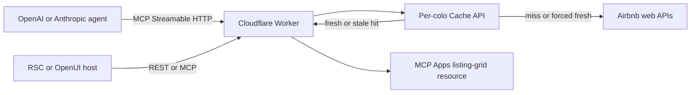

# Architecture and latency model

## Request flow

The Worker is stateless and creates a fresh MCP server instance per request.
This matches Cloudflare's current `createMcpHandler()` guidance and avoids a
Durable Object hop for read-only tools.

## Cache strategy

All keys are a SHA-256 digest of recursively sorted JSON. The request parameters
remain out of the synthetic Cache API URL.

| Data | Fresh | Stale fallback |
|---|---:|---:|
| Public Airbnb API key | 6 hours | 24 hours |
| Market/autocomplete configuration | 6 hours | 24 hours |
| Resolved location | 24 hours | 7 days |
| Search page | 5 minutes | 1 hour |
| Exact listing quote | 1 minute | 10 minutes |
| Availability calendar | 5 minutes | 1 hour |

Fresh hits return immediately. Stale hits return immediately and use
`ctx.waitUntil()` for refresh. A loader failure falls back to a still-valid
stale envelope. `require_fresh=true` bypasses freshness but can still use stale
data when the origin fails.

An isolate-local L0 single-flight map coalesces identical concurrent misses and
background refreshes before the Cache API write. Cache namespaces are
versioned; normalization or integrity changes bump the namespace so
incompatible edge entries cannot leak into a new schema.

## Why the original path was slow

The Python facade previously scraped the Airbnb homepage for a public API key on
every top-level search, disabled connection reuse with `Connection: close`,
injected a fixed Galapagos query into unrelated map requests, and paginated
serially without a deadline or page budget. A first-page baseline timed out at
15 seconds before reaching the search request.

The upgraded Python path caches API-key discovery, reuses isolated sessions,
builds validated filters, and offers optional result/page/deadline budgets while
preserving legacy unbounded behavior when budgets are omitted.

## Honest service-level objective

The hard target applies to cached/indexed responses. A live scrape is best
effort because upstream latency, throttling, challenges, and schema changes are
outside this service's control. Measure these lanes separately:

- edge-cache hit latency;
- warm live first-page latency;
- forced-origin latency;
- flexible-date fan-out latency;
- quote/calendar latency.

Every result carries timing and freshness metadata so an agent can state which
lane produced it.

Flexible-date responses aggregate child cache/freshness metadata, preserve
child warnings, and set `sampled=true` when a broad window exceeds the fan-out
budget. Dates and trip lengths are distributed across the window instead of
consuming the budget on its first matching day.

## Upstream recovery

Airbnb public API credentials are refreshed once on a 401/403 response, with
the refresh itself coalesced. If Airbnb rejects the StaysSearch persisted query,
the Worker discovers the current operation ID from Airbnb's published web
bundles, caches it, and retries once. Other invalid inputs and upstream errors
are never retried blindly.

## Module boundaries

The Worker is split by responsibility: transport/client, location resolution,
exact search, flexible planning, payload normalization, quote, availability,
schemas, MCP registration, HTTP policy, cache, and UI resource. External
payload validation happens before domain results enter cache or UI adapters.

## Scaling beyond exact-query cache

For large production workloads, add an indexed D1 inventory/availability store,
a Queue/Workflow refresh pipeline, and a Durable Object keyed by normalized
query for single-flight refreshes. Keep that background ingestion path separate
from the synchronous MCP card response.
